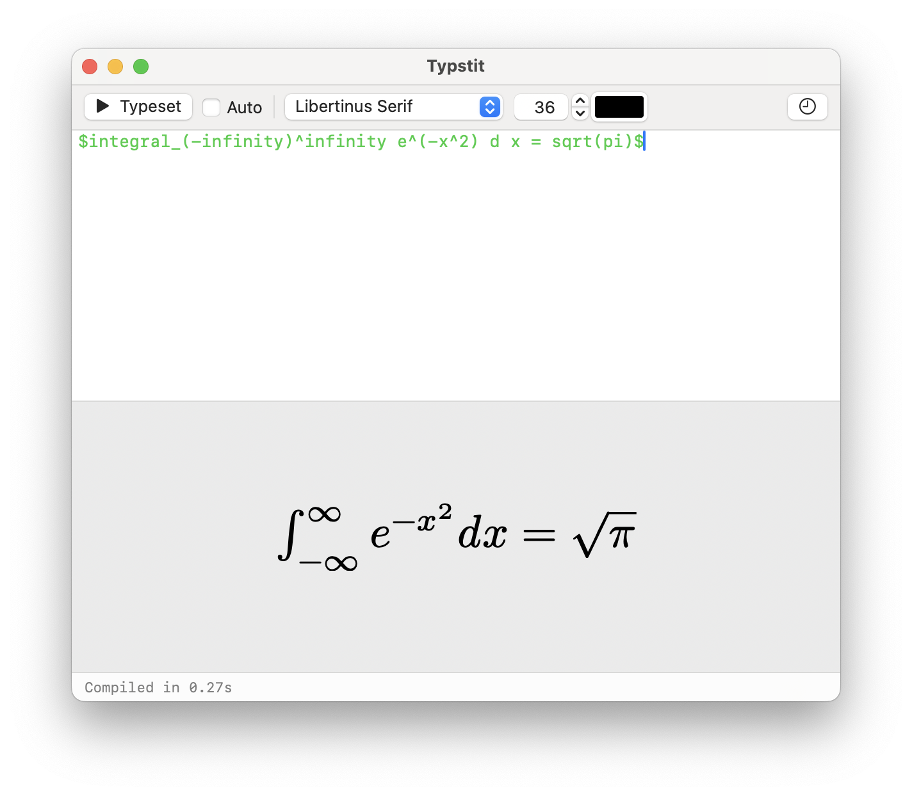

<div align="center">


# Typstit

**A [LaTeXit](https://www.chachatelier.fr/latexit/)-style snippet renderer for [Typst](https://typst.app)**

Type a Typst snippet. Hit **⌘T**. Drag the result into Pages, Keynote, Word, or any app that accepts PDF.

<br>



</div>

---

## What it does

Typstit is a small native macOS app that compiles Typst snippets on demand and lets you drag the output — as a real, vector PDF — into other applications. It works exactly like LaTeXit, but for Typst instead of LaTeX.

The page is auto-sized to fit the content tightly, so what you drag is just the rendered snippet with no surrounding whitespace — ready to drop into a slide or document at any size without quality loss.

## Features

- **Instant compilation** — press ⌘T (or enable Auto mode) to render your snippet
- **Drag to anywhere** — the preview is a live drag source; drop it into Pages, Keynote, Word, Finder, Mail, or any PDF-accepting app
- **Source round-trip** — copy a Typstit PDF from Keynote back into your clipboard, then press ⌘⇧V to recover the original Typst source
- **History** — every compiled snippet is saved with a thumbnail and timestamp; click any entry to restore it (⌘H)
- **Syntax highlighting** — headings, math, commands, strings, and comments are highlighted in the editor
- **Font, size & colour controls** — choose any installed system font (plus Typst's bundled fonts), set the point size, and pick a text colour from a standard colour picker
- **Workspace directory** — Typst runs with `~/Library/Application Support/Typstit/workspace/` as its working directory, so your snippets can reference local CSV files, images, and other assets with plain relative paths

## Requirements

- macOS 13 Ventura or later
- The `typst` CLI on your machine

Install Typst with [Homebrew](https://brew.sh):

```sh
brew install typst
```

## Installation

### Download

Download the latest `Typstit.app` from the [Releases](../../releases) page, drag it to `/Applications/`, and right-click → Open on first launch to bypass Gatekeeper.

### Build from source

```sh
git clone https://github.com/yourusername/typstit
cd typstit
bash build-app.sh
```

This produces `Typstit.app` in the current directory. Copy it to `/Applications/` or run it in place.

**Requirements for building:** Xcode Command Line Tools (`xcode-select --install`).

## Usage

| Action | How |
|---|---|
| Compile snippet | ⌘T |
| Toggle auto-compile | ⌘⇧T, or the **Auto** checkbox in the toolbar |
| Open history | ⌘Y |
| Restore source from clipboard PDF | ⌘⇧V |
| Drag output to another app | Click and drag the preview panel |

### Using local files in snippets

Place CSV files, images, or other assets in:

```
~/Library/Application Support/Typstit/workspace/
```

Then reference them in your snippet with a relative path:

```typst
#let data = csv("sales.csv")
```

## How the source round-trip works

Typstit embeds your Typst source invisibly in every PDF it produces (as transparent zero-size text in the content stream). This survives being pasted into Keynote and copied back out. Press ⌘⇧V with such a PDF on the clipboard to recover the source into the editor.

## License

MIT
